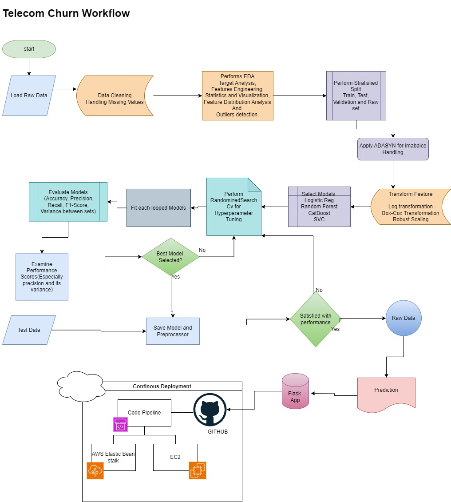
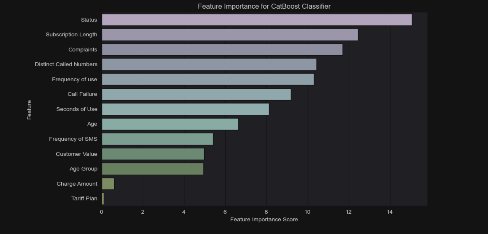

# Telecom Churn Prediction Project

## Project Overview

The project follows a structured approach to data analysis, model development, and continuous deployment.

The key objectives include:

1. Understanding the dataset through exploratory data  analysis.

2. Extracting meaningful insights to understand factors contributing to churn.

3. Building and refining model that predicts Churn.

4. Structuring code into modular components for scalability and deployment.

5. Implementing continuous deployment using AWS Elastic Beanstalk and CodePipeline.

## Project Structure

TelecomChurnModel/
├── .ebextensions/
├── artifacts/
│   ├── data.csv
│   ├── model.pkl
│   ├── preprocessor.pkl
│   ├── raw.csv
│   ├── test.csv
│   ├── train.csv
│   └── validation.csv
├── catboost_info/
├── logs/
├── myenv/
├── notebook/
│   ├── .ipynb_checkpoints/
│   ├── catboost_info/
│   ├── data/
│   ├── EDA.ipynb
│   └── Model_Trainer.ipynb
├── src/
│   ├── component/
│   │   ├── __init__.py
│   │   ├── data_ingestion.py
│   │   ├── data_transformation.py
│   │   └── model_training.py
│   └── pipeline/
│       ├── logs/
│       ├── __init__.py
│       ├── pred_pipeline.py
│       ├── train_pipeline.py
│       ├── exception.py
│       ├── logger.py
│       └── utils.py
├── templates/
│   ├── home.html
│   └── index.html
├── .gitignore
├── application.py
├── README.md
├── requirements.txt
└── setup.py

## Process Flow

## Key Insights from Exploratory Data Analysis (_EDA.ipynb_)

#### Complaints
1. Business Impact:
   Complaint rate: 8.1% of customers filed complaints (230 out of 2850).

    45% of customers who churned had complaints (190 out of 420 churned).
    
    Addressing complaints proactively can reduce churn and improve customer loyalty.

#### Charge Amount
1. Business Impact:
    The majority (1575 out of 2850) fall within the lowest charge amount (0).

    Churn is more prominent in the lower charge amounts, with 517 churned customers in that group.
   
    Explore personalized charge plans to increase revenue per user without increasing churn.

####  Age Group
1. Business Impact:
    The 30-year-old segment (1296 out of 2850) has the highest customer base, with 16.5% churn (213 out of 1296).
   
    Older customers (age 5) show lower churn, at just 1.3% (2 churned out of 154).
   
    Focus retention efforts on the 30-40 age group, which is most at risk.

#### Status (Active vs Non-Active)
1. Business Impact:
Inactive customers: 684 out of 2850 are inactive, and 47% of them churned (325 out of 684).

Inactive customers are a significant churn risk. Reactivation campaigns targeting these customers can lower churn.
    

    

#### 5. Tariff Plan
   1. Business Impact:
   
        Pay-As-You-Go (Plan 1) customers represent 91% of the base (2621 out of 2850).
       
        Churn in this plan is high, with 16.8% churn rate (440 out of 2621).
        
        Contractual plans (Plan 2) show much lower churn (2.6%, 6 out of 229).
        
        Focus retention efforts and special offers on Pay-As-You-Go customers to improve retention.

## Modeling Insights

1. Model Performance
   Best Model: CatBoost achieved the highest performance:
Accuracy: 92.6%

Precision: 73.7%

Recall: 82.02%

F1 Score: 77.6%

AUC: 96.8%

2. Key Predictors of Churn

#### Insights
Status Strongly affects churn prediction,
Subscription Length is also Highly influential, shorter subscriptions may indicate churn.
More complaints leads to higher churn risk.
How often customers use the service also impacts churn.
Least important	feature, the Tariff plan has minimal impact on churn.

#### Business Value
1. Customer Retention Strategies
Targeted Offers: Provide discounts or incentives to customers with shorter subscription lengths or higher monthly charges.

Improve Service Quality: Reduce call failures and improve network reliability to retain customers.

Proactive Complaint Resolution: Address customer complaints quickly to reduce churn.

2. Operational Efficiency
   The predictive model allows the company to prioritize retention efforts on high risk customers, improving resource allocation and reducing operational costs.

## **Deployment Considerations:**

Packaged the model and preprocessing pipeline.

Built an API with Flask for real-time predictions.

Integrated CD pipeline with AWS services.

## Continuous Deployment

This project integrates AWS Elastic Beanstalk and CodePipeline for automatic deployment. The process includes:

**Source Code Management:**

The application is hosted on GitHub. Each commit triggers AWS CodePipeline.

**AWS CodePipeline:**

Fetches the latest changes from the GitHub repository. Builds and packages the application.

**AWS Elastic Beanstalk Deployment:** Deploys the Flask-based model API as a live service. Manages application scaling and load balancing.

Monitoring and Updates:

Application logs are stored for debugging. Performance monitoring through AWS CloudWatch. Future improvements include automated rollback in case of failures.

